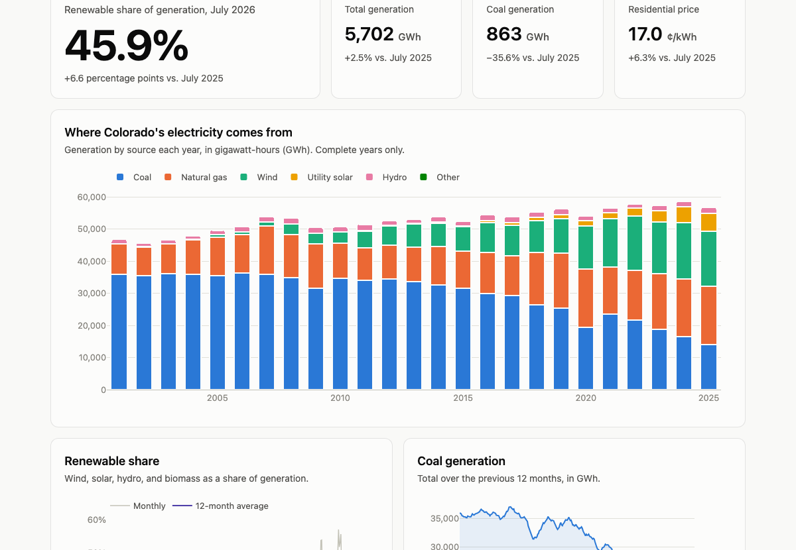

# Colorado Energy Tracker

An automated dashboard showing how Colorado's electricity is generated and what it costs, rebuilt every month from U.S. Energy Information Administration (EIA) data.

**Live site:** https://lesfoucher.github.io/Colorado-energy-tracker/



## What it shows

- **Renewable share** of Colorado's electricity, with the change from the same month a year earlier
- **Generation by source** (coal, natural gas, wind, solar, hydro) for every year since 2001
- **Coal's decline**, as a 12-month rolling total
- **Electricity prices** for homes, businesses, and industry
- **A plain-English monthly summary** written by Claude, published only after every number in it has been checked against the database
- A table of the last 24 months and a CSV download of the full history

## How it works

```
EIA API ──▶ fetch.py ──▶ clean.py ──▶ SQLite ──▶ metrics.sql ──▶ export.py ──▶ site/
           (download)   (clean and   (load)     (metric views)  (JSON, CSV)    (dashboard)
                         check)                                      │
                                                                     ▼
                                                    summarize.py (Claude + number check)
```

1. **Fetch.** Download monthly generation and price data for Colorado from the EIA API (about 4,400 rows from January 2001 on), plus the EIA's published annual state totals for cross-checking.
2. **Clean and check.** Convert values to numbers, then stop the run if anything doesn't add up: the sources must sum to the total each month, the EIA's two renewables totals must agree, and every year's total must match the EIA's separately published Colorado state profile.
3. **Load.** Rebuild a SQLite database from scratch on every run, so the EIA's revisions to recent months are always picked up.
4. **Calculate.** Each metric is a SQL view in [`sql/metrics.sql`](sql/metrics.sql): generation mix, renewable share, year-over-year changes, rolling totals, and prices.
5. **Publish.** Export the metrics to JSON and CSV for a static dashboard built with Plotly.js.
6. **Summarize.** Send the latest numbers to Claude for a 2–3 sentence summary. Code then checks that every number in the summary matches the data and that every change is described in the right direction. If anything is off, no summary is published that month.
7. **Automate.** A [GitHub Actions workflow](.github/workflows/monthly.yml) runs all of this on the 28th of each month: tests, data refresh, spot checks, summary, and deployment to GitHub Pages.

## Data decisions worth knowing

These are documented in full in [`docs/requirements.md`](docs/requirements.md).

- **The EIA's "all renewables" code leaves out hydropower.** Its other renewables code includes hydro but is missing for 2001–2002. The tracker uses "all renewables" plus hydro, which matches the second code exactly in every month where it exists, and covers the full history.
- **Rooftop solar is shown separately.** The EIA only estimates it (from 2014 on), and it isn't part of the official total.
- **Year-over-year changes always compare the same month.** Comparing July with June would mostly measure the weather.
- **Prices are not adjusted for inflation**, and the dashboard says so.

## Tests

```bash
pytest
```

- **Pipeline tests** use small, hand-built datasets with known answers, covering the cleaning rules, every data check, and every SQL metric.
- **Summary tests** replace Claude with a fake client, to confirm that wrong numbers, made-up numbers, and changes described in the wrong direction are all caught and never published.
- **Real-data spot checks** compare the live database against reference numbers taken directly from the EIA API.

## Run it yourself

Requires Python 3.11+ and a free [EIA API key](https://www.eia.gov/opendata/). A [Claude API key](https://console.anthropic.com/) is optional; it's only needed for the summary.

```bash
python3.11 -m venv .venv && source .venv/bin/activate
pip install -r requirements.txt
cp .env.example .env            # then add your keys to .env

python -m pipeline.run          # download, check, and load the data
python -m pipeline.export       # write site/data.json and the CSV
python -m pipeline.summarize    # optional AI summary
python -m http.server 8765 --directory site   # open http://localhost:8765
```

To deploy your own copy: add `EIA_API_KEY` (and optionally `ANTHROPIC_API_KEY`) as repository secrets, and set **Settings → Pages → Source** to **GitHub Actions**.

## Project structure

```
pipeline/   fetch.py, clean.py, load.py, export.py, summarize.py, run.py
sql/        metrics.sql (metric definitions as SQL views)
site/       index.html (the dashboard)
tests/      pipeline, summary, and real-data tests
docs/       requirements.md (metric definitions and data decisions)
```

## Credits

- Built by Alex Foucher with help from [Claude](https://www.anthropic.com/claude), Anthropic's AI model, using Claude Code.
- Data: U.S. Energy Information Administration, [Open Data API](https://www.eia.gov/opendata/). Public domain.
